<div align="center">
  
</div>

<br>

<div align="center">
  
</div>

<br>

<div align="center">

[](https://instagram.com/leonardoarazo)
[](https://facebook.com/LeonardoArazo)
[](#)
[](#)

</div>

---

## `> whoami`

```
Computer Science student & researcher @ UNIFESP
Specialization : Artificial Intelligence · Computational Mathematics · Intelligent Systems
Current focus  : Image compression (SVD, Compressed Sensing) + Neural Reconstruction
Side project   : SentiNela — Conversational AI for epidemiological surveillance
Philosophy     : Mathematics gives structure. ML gives adaptability. AI emerges from both.
```

<table>
<tr>
<td width="50%" valign="top">

### 🔬 Research Areas
- **Large Language Models** — architecture & fine-tuning
- **Retrieval Augmented Generation** — semantic search pipelines
- **Computer Vision** — detection, segmentation, reconstruction
- **Image Compression** — SVD, Compressed Sensing, sparse methods
- **Computational Mathematics** — linear algebra, optimization
- **AI Systems Architecture** — multi-agent, orchestration

</td>
<td width="50%" valign="top">

### ⚗️ Current Research Projects

| Project | Description |
|---|---|
| 📐 **SVD Compression** | Singular Value Decomposition for image compression & reconstruction |
| 🔀 **Compressed Sensing** | Sparse reconstruction for high-efficiency image representation |
| 🧠 **Neural Reconstruction** | Neural networks reconstructing compressed image representations |
| 🏥 **SentiNela** | Conversational AI for clinical surveillance & epidemiological trends |

</td>
</tr>
</table>

---

## `> cat tech_stack.json`

<details open>
<summary><b>🤖 Artificial Intelligence & ML</b></summary>
<br>


</details>

<details open>
<summary><b>⚙️ Systems & Infrastructure</b></summary>
<br>


</details>

<details open>
<summary><b>💻 Programming Languages</b></summary>
<br>


</details>

<details open>
<summary><b>🗄️ Databases</b></summary>
<br>


</details>

<details open>
<summary><b>🧩 AI Tools Ecosystem</b></summary>
<br>


</details>

---

## `> git log --stat`

<div align="center">


<br>


</div>

---

## `> echo $RESEARCH_MINDSET`

<div align="center">

```
┌──────────────────────────────────────────────────────────────────┐
│                                                                  │
│   "Mathematics gives structure.                                  │
│    Machine learning gives adaptability.                          │
│    Artificial intelligence emerges from both."                   │
│                                                                  │
│                                          — Leonardo Arazo        │
└──────────────────────────────────────────────────────────────────┘
```

</div>

---

<div align="center">

<sub>
  <b>AI</b> · <b>Mathematics</b> · <b>Algorithms</b> · <b>Systems</b>
  <br><br>
  
</sub>

</div>
